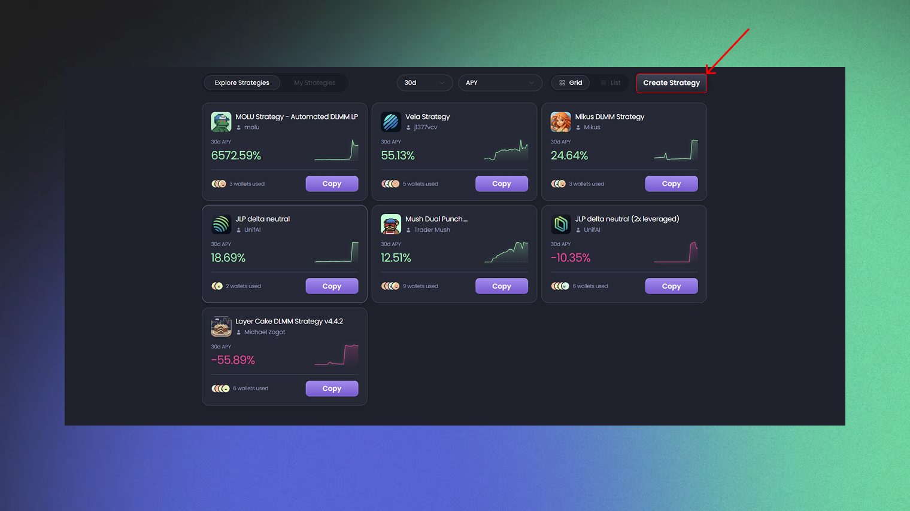

# 📰 How To Create A Strategy

1. <kbd>**Accessing the Strategy Agent**</kbd>

To start, go to the **Agents** page [@ chat.unifai.network](https://chat.unifai.network/) and click on **Strategies**.

2. <kbd>**Log In**</kbd>

Click the **Sign in** button in the top right corner and connect your Telegram account to log in.

<figure><figcaption></figcaption></figure>


3. <kbd>**Create a Strategy Execution Agent**</kbd>
4.

    <figure><figcaption></figcaption></figure>

**You can choose to use any available template or create a custom strategy and you can write your prompt** by describing the strategy you want to automate to the Strategy Creator Agent using natural language.

Try to follow this format: **Trigger + Action**. UnifAI currently supports triggers based on time or price. Time-based triggers let you run strategies daily, hourly, or on custom schedules, while price-based triggers execute actions automatically when a token's price hits a specific level. The "action" part can include any logic, such as fetching data or executing trades. The more precise your instructions, the better.

**Here are some examples:**

* **Meteora DLMM Automation Strategy:** An example of an automated strategy for a Meteora DLMM pool.

```
Every 4h:
Find DLMM pools with the following criteria:
- FDV: >= $10,000,000 and <= $300,000,000
- TVL: >= $5,000
- 24h fees: >= $5,000
- Quote Token: SOL
- Base Fee: >= 1%
- bin step: >=80 and <= 250
- 24h fee/tvl >= 1%
- 24h volume/liquidity > 1
- Base Token Age: >= 48 hours
- Base Token Price Change% 1h > 0
- Base Token 1h Volume: >= $100,000
- Base Token 24h Volume: >= $500,000
- Base Token Liquidity: >= $300,000
- Base Jupiter Organic Score: >= 65
- Only keep one pool per token: keep the one with the higher 24h fee
Only if all the above conditions are met, proceed to add liquidity. Otherwise, skip.
If token already exists in current positions, do not add again.
If the selected pool satisfies all conditions, and the current number of positions is less than 5, proceed to add liquidity:
- Size: 0.5 SOL
- Strategy: SOL single-sided, Bid-ask strategy, default price range
- real time stop loss: PnL% -8%
- real time take profit: PnL% +10%
- out of range: If current pool price is 5% above the max price range of the position, then remove liquidity, claim fees, and convert to SOL
Apart from take-profit, stop-loss, and out-of-range scenarios, do not remove liquidity under any other conditions.
```


4. <kbd>**Wallet Setup**</kbd>
   * **Create a Wallet** Click the **Create Wallet** button to generate a secure, Privy-powered crypto wallet. You can choose a **Solana** or **EVM** wallet and give it a name that matches your strategy.

<figure><figcaption></figcaption></figure>

or create wallet directly when you create the agent

<figure><figcaption></figcaption></figure>

* About the Wallet Private Keys - Exporting Private keys
  * Go to - [https://chat.unifai.network/c/new?t=managewallets](https://chat.unifai.network/c/new?t=managewallets)
  * Click on "private key" next to the wallet you would like to export
  * Click on Reveal private key\

*   **Fund Your Wallet** On the **Deposit** page, send funds to your new wallet address. **Make sure you select the correct blockchain network.** For example:

    * For an automated Meteora or meme coin strategy on the Solana network, choose **Solana**.

    You can deposit funds from an existing wallet or a centralized exchange (CEX). \
    [⚠️ **Always double-check the wallet address and blockchain network before transferring funds. When in doubt, start with a small test transaction.**](#user-content-fn-1)[^1]

<figure><figcaption></figcaption></figure>

* **Verify Your Balance** After depositing, wait for the blockchain transaction to be confirmed. You can then check your wallet's asset balance on the **Wallet** page.


5. <kbd>**Managing Strategies**</kbd>

* **Strategy Monitoring** You'll receive an execution report via Telegram every time a strategy runs.

<figure><figcaption></figcaption></figure>

* Fine-Tuning Strategies On the Strategy page, you can check your strategy's status and edit or pause it.
  \
  You can edit and fine-tune your strategies on the Strategy page. Currently, you can only edit the Instructions, not the trigger conditions. If you need to change the trigger, stop the current strategy and create a new one.

<figure><figcaption></figcaption></figure>

* **Active:** The strategy is currently running.
* **Completed:** The strategy has finished (e.g., a one-time strategy that won't run again).
* **Canceled:** The strategy was stopped by the user. Canceled strategies can't be restarted, but you can create a new one.
* **Expired:** The strategy has passed its scheduled end time.
* **Checking Your Assets and Positions** The **Wallet** page shows your total assets and their historical changes. The total assets include your token holdings, Meteora positions, fees, and DLMM position rent.

You can also see your current **open positions**. If needed, you can manually close any Meteora positions here.

<figure><figcaption></figcaption></figure>

[^1]: 
